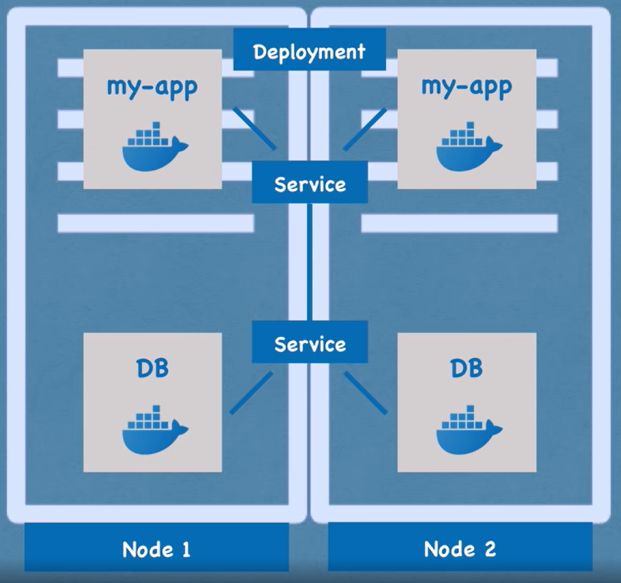
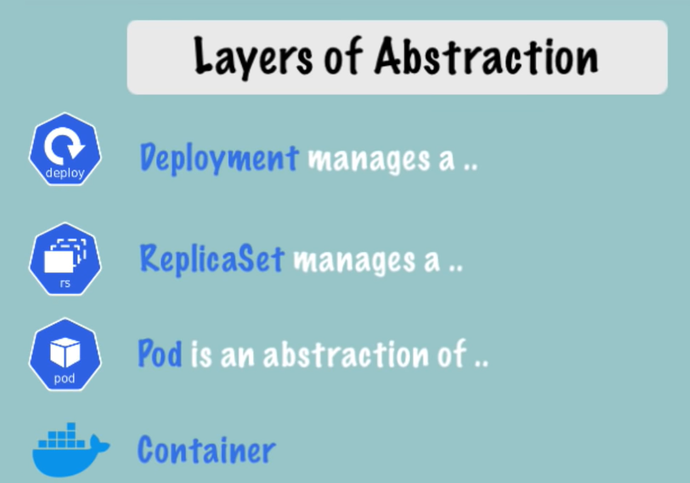

# Kubernetes Course:

## Kubernetes Features:
  - High Availability and No Downtime
  - Scalability and High Performance
  - Disaster Recovery

## Kubernetes Components: 
  - **Pod** (Smallest unit of k8s or abstraction over container)
      - Usually 1 app per pod
      - Each pod gets its own IP address (New IP address on re-creation)
  - **Service** (Each pod have service that provide by pod but lifecycle of pod not connected to service)
      - Have permanent IP address
      - Service can share between replica nodes
      - Service have load balancer
  - **Ingress** (Service Discovery of each service of node)
  - **ConfigMap** (External configuration of application)
  - **Secret** (Used to store secret data like credentials - base64 encoded)
  - **Volumes** (Data store component of Kubernetes that can stores on local machine or remote storage)
  - **Node** (Node can have one or more (Pod+Service)) like: 
      - node1: 
            app (Pod+Service) + db (Pod+Service) + Ingress + ConfigMap + Secret + Volumes
  - **Deployment** (One or more node(s) that have only one duty to do something) - for Stateless apps
  - **StatefulSet** (One or more node(s) that have only one duty to do something) - for Stateful apps

  
  

## Kubernetes Architecture:
  - **About worker node:**
    - Each Nodes has multiple Pods on it
    - 3 Process must be installed on every node
      - Container runtime (like docker or container d)
      - kubelet (interact with both the container and node)
      - KubeProxy (Communication with services and forwards the requests)
    - Worker nodes do the actual work
  - **About Master Node:**
    - 4 Process must be installed on every node
      - Api Server (is a cluster gateway that client can communicate with kubernetes)
        - like panel or CLI
        - get request then validate then send that for process
      - Scheduler (schedule new pod or schedule terminate pod)
        - Scheduler just decides on which Node new Pod should be scheduled
        - Scheduler Know How much resource used and need, base on it decided new pod must schedule on which Node
      - Controller manager
        - detects cluster state changes (pod die, or need to re-schedule)
        - if detect one of state that must be have reaction send request to scheduler to schedule that
      - etcd (is the cluster brain, cluster changes get stored in the key-value store)
        - note: application data is not stored in etcd.

## Minikube and Kubectl:
  - **Minikube**
    - Use for test purposes.
    - Master and node processes run on one machine.
    - Have a preinstalled docker runtime as a container runtime.
    - Creates Virtual box on your machine, and nodes run on virtual box.
    - One Node k8s cluster
  - **Kubectl**
    - Enable interaction with cluster (CLI)
    - Uses for any type cluster (Minikube cluster and Cloud cluster)

## Main Kubectl Commands:
  - **CRUD Commands**
    - kubectl create deployment [name] --image=[image name]
    - kubectl edit deployment [name] --image=[image name]
    - kubectl delete deployment [name] --image=[image name]
    - kubectl apply -f [DeploymentConfig.yaml]
  - **Status of component**
    - kubectl get nodes
    - kubectl get pod
    - kubectl get services
    - kubectl get replicaset
    - kubectl get deployment
  - **Debug**
    - kubectl logs [pod name]
    - kubectl exec -it [pod name] -- bin/bash

## YAML Configuration file:
  - **Sample:**
    - Deployment & Service

```yaml 
apiVersion: apps/v1
kind: Deployment
metadata:
  name: nginx-deployment
  labels:
    app: nginx
spec:
  replicas: 3
  selector:
    matchLabels:
      app: nginx
  template:
    metadata:
      labels:
        app: nginx
    spec:
      containers:
      - name: nginx
        image: nginx:1.16
        ports:
        - containerPort: 8080
```
```yaml
apiVersion: v1
kind: Service
metadata:
  name: nginx-service
spec:
  selector:
    app: nginx
  ports:
    - protocol: TCP
      port: 80
      targetPort: 8080
```
## Sample Project
  - **Steps:**
    - Create [mongo deployment file](MongoDbSample/mongo.yaml)
    - Create [mongo secret file](MongoDbSample/mongo-secret.yaml)
    - Execute Command: `kubectl apply -f mongo-secret.yaml` in MongoDbSample directory
    - Add Secret reference to [mongo deployment file](MongoDbSample/mongo.yaml)
    - Execute Command: `kubectl apply -f mongo.yaml`
    - Add Service configuration in [mongo deployment file](MongoDbSample/mongo.yaml) after `---`
    - Create [mongo-express deployment file](MongoDbSample/mongo-express.yaml)
    - Create [mongo configmap file](MongoDbSample/mongo-configmap.yaml)
    - Execute Command: `kubectl apply -f mongo-configmap.yaml` in MongoDbSample directory
    - Add Service configuration in [mongo-express deployment file](MongoDbSample/mongo-express.yaml) after `---`
    - Execute Command: `kubectl apply -f mongo-express.yaml` in MongoDbSample directory
    - you can see status with command: `kubectl get all | grep mongo`