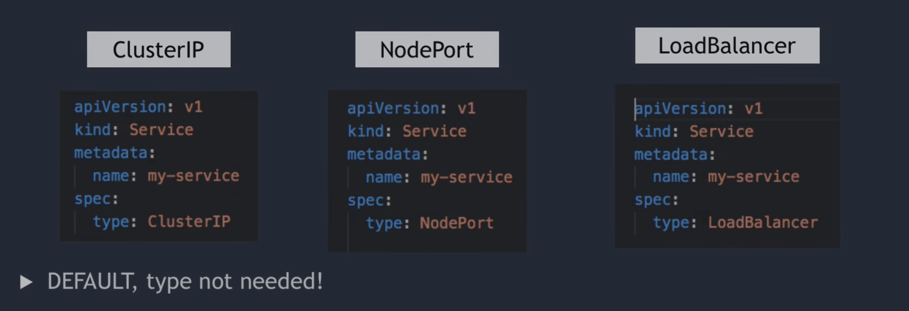

# Kubernetes For Humans:

## Kubernetes Features:
- High Availability and No Downtime
- Scalability and High Performance
- Disaster Recovery

## Kubernetes Components:
- **Pod** (Smallest unit of k8s or abstraction over a container)
    - Usually, 1 app per pod
    - Each pod gets its own IP address (New IP address on recreation)
- **Service** (Each pod has a service that provides by the pod, but the lifecycle of the pod is not connected to the service)
    - Has a permanent IP address
    - Service can be shared between replica nodes
    - Service has a load balancer
- **Ingress** (Service Discovery of each service of the node)
- **ConfigMap** (External configuration of the application)
- **Secret** (Used to store secret data like credentials - base64 encoded)
- **Volumes** (Data store component of Kubernetes that can store on a local machine or remote storage)
- **Node** (A node can have one or more (Pod + Service)) like:
    - node1:
      app (Pod + Service) + db (Pod + Service) + Ingress + ConfigMap + Secret + Volumes
- **Deployment** (One or more node(s) that have only one duty to do something) - for Stateless apps
- **StatefulSet** (One or more node(s) that have only one duty to do something) - for Stateful apps

  
  

## Kubernetes Architecture:
- **About the worker node:**
    - Each node has multiple Pods on it
    - 3 Processes must be installed on every node
        - Container runtime (like Docker or container d)
        - Kubelet (interacts with both the container and node)
        - KubeProxy (Communication with services and forwards the requests)
    - Worker nodes do the actual work
- **About the Master Node:**
    - 4 Processes must be installed on every node
        - API Server (is a cluster gateway that clients can communicate with Kubernetes)
            - like a panel or CLI
            - get request then validate then send that for process
        - Scheduler (schedule new pod or schedule terminate pod)
            - Scheduler just decides on which Node new Pod should be scheduled
            - Scheduler Knows how much resource is used and needed, based on it decides new pod must schedule on which Node
        - Controller manager
            - detects cluster state changes (pod dies, or needs to reschedule)
            - if detects one of the states that must have a reaction, send a request to the scheduler to schedule that
        - etcd (is the cluster brain, cluster changes get stored in the key-value store)
            - note: application data is not stored in etcd.

## Minikube and Kubectl:
- **Minikube**
    - Used for test purposes.
    - Master and node processes run on one machine.
    - Has a preinstalled Docker runtime as a container runtime.
    - Creates Virtual Box on your machine, and nodes run on Virtual Box.
    - One Node k8s cluster
- **Kubectl**
    - Enables interaction with the cluster (CLI)
    - Used for any type of cluster (Minikube cluster and Cloud cluster)

## Main Kubectl Commands:
- **CRUD Commands**
    - kubectl create deployment [name] --image=[image name]
    - kubectl edit deployment [name] --image=[image name]
    - kubectl delete deployment [name] --image=[image name]
    - kubectl apply -f [DeploymentConfig.yaml]
- **Status of component**
    - kubectl get nodes
    - kubectl get pod
    - kubectl get services
    - kubectl get replicaset
    - kubectl get deployment
- **Debug**
    - kubectl logs [pod name]
    - kubectl exec -it [pod name] -- bin/bash

## YAML Configuration file:
- **Sample:**
    - Deployment & Service

```yaml 
apiVersion: apps/v1
kind: Deployment
metadata:
  name: nginx-deployment
  labels:
    app: nginx
spec:
  replicas: 3
  selector:
    matchLabels:
      app: nginx
  template:
    metadata:
      labels:
        app: nginx
    spec:
      containers:
      - name: nginx
        image: nginx:1.16
        ports:
        - containerPort: 8080
```
```yaml
apiVersion: v1
kind: Service
metadata:
  name: nginx-service
spec:
  selector:
    app: nginx
  ports:
    - protocol: TCP
      port: 80
      targetPort: 8080
```
### Service types


## Sample Project
- **Steps:**
    - Create [mongo deployment file](MongoDbSample/mongo.yaml)
    - Create [mongo secret file](MongoDbSample/mongo-secret.yaml)
    - Execute Command: `kubectl apply -f mongo-secret.yaml` in the MongoDbSample directory
    - Add Secret reference to [mongo deployment file](MongoDbSample/mongo.yaml)
    - Execute Command: `kubectl apply -f mongo.yaml`
    - Add Service configuration in [mongo deployment file](MongoDbSample/mongo.yaml) after `---`
    - Create [mongo-express deployment file](MongoDbSample/mongo-express.yaml)
    - Create [mongo configmap file](MongoDbSample/mongo-configmap.yaml)
    - Execute Command: `kubectl apply -f mongo-configmap.yaml` in the MongoDbSample directory
    - Add Service configuration in [mongo-express deployment file](MongoDbSample/mongo-express.yaml) after `---`
    - Execute Command: `kubectl apply -f mongo-express.yaml` in the MongoDbSample directory
    - You can see the status with the command: `kubectl get all | grep mongo`
    - To delete the deployment, execute the command: `kubectl delete deployment [deployment name]`
    - To delete the service, execute the command: `kubectl delete services [service name]`

## Namespace
- **Default namespaces**
- Execute the command: `kubectl get namespace`
    - default (if you don't create a namespace your resource is located here)
    - kube-public (contains public data like configmap, cluster information, ...)
    - kube-system (Don't create or modify this)
    - kube-node-lease (heartbeats of nodes, each node has a lease object)
    - kubernetes-dashboard
- You can create a namespace with the command: `kubectl create namespace my-namespace`
- You can set the namespace of the component by two approaches:
    - use `--namespace=my-namespace` for example: `kubectl apply -f mongo-configmap.yaml --namespace=my-namespace`
    - use `namespace: my-namespace` in the yaml file under `metadata:`

## Ingress
- When we don't want to access the internal service IP address

and we want to use a domain name and secure protocol, use the Ingress component. For example, use `https://my-app.com` instead of `http://124.8.2.1:35000`
- Create [Mongo Ingress.yaml](MongoDbSample/Ingress.yaml)
- Execute Command: `kubectl apply -f Ingress.yaml` in the MongoDbSample directory
- You can see the Ingress list with `kubectl get ingress`
- You can configure https and tls like [Ingress-tls.yaml](MongoDbSample/Ingress-tls.yaml) and use this [mylocalmongo-secret-tls.yaml](MongoDbSample/mylocalmongo-secret-tls.yaml)

## Helm Package
- Helm is a package manager for Kubernetes
- Helm can help to package YAML files.
- Helm Chart:
    - bundle of YAML files
    - Create your Own Helm Chart
    - Push them to Helm Repository
    - Download and use the existing one (reusable)
- Used for complex setups (Like monitoring apps that have ELK, Grafana, Prometheus, ...)
- You can share Helm Charts Configurations. Or use other configurations in [Helm hub](https://artifacthub.io/) or use the command `helm search <Keyword>`
- Helm has a Template Engine for Same deployments.
    - for Example: Create [my-app-template.yaml](my-app-chart/Templates/my-app-template.yaml) and use `{{.Values..}}` template for reading values from [values.yaml](my-app-chart/values.yaml)
- Another feature of Helm is you can deploy the same Applications to different environments.
- The directory structure must be like [my-app-chart](my-app-chart) directory.
    - [chart.yaml](my-app-chart/chart.yaml) --> meta info about the chart.
    - [values.yaml](my-app-chart/values.yaml) --> values for template files.
    - [Charts folder](my-app-chart/Charts) --> chart dependencies. all YAML files that are needed.
    - [Templates](my-app-chart/Templates) --> actual template files.
- You can execute `helm install chart.yaml` to install all packages and dependencies.
- If you have dependencies you can create [requirements.yaml](my-app-chart/requirements.yaml) and execute `helm dependency update` in this section dependency added to the charts folder.
- Helm version 2 has two parts:
    - Client(Helm CLI)
    - Server(Tiller) But `Tiller` got removed in version 3 because it has security issues.

## Persistent Volume
- You can use all types of storage to store your persistent volumes like: local, cloud, nfs, ...
- To have a local volume:
    - create [persistentVolume.yaml](MongoDbSample/persistentVolume.yaml)
    - add `volumeMounts` and `volumes` config to the deployment or pod yaml file like: [mongo.yaml](MongoDbSample/mongo.yaml)
- Storage class can create persistent volumes dynamically.
    - created like this file: [storageClass.yaml](MongoDbSample/storageClass.yaml)
    - and reference that in `storageClassName` in [persistentVolume.yaml](MongoDbSample/persistentVolume.yaml)